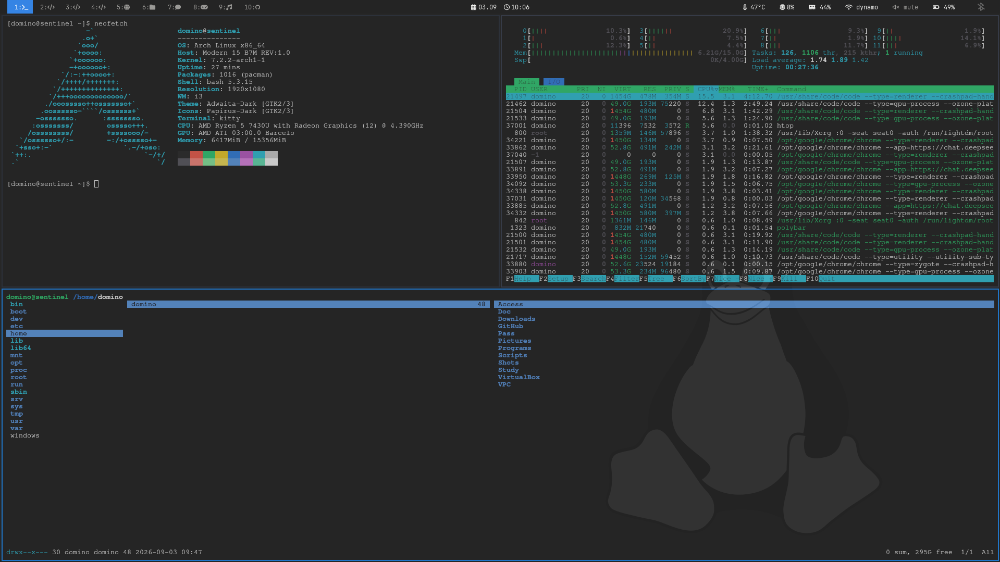
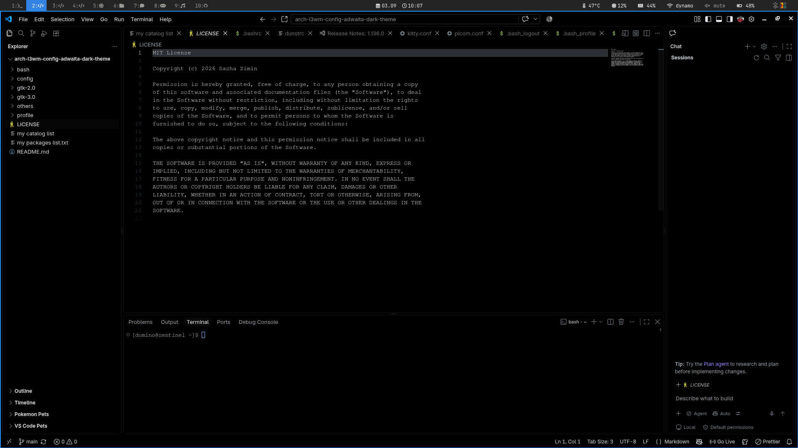
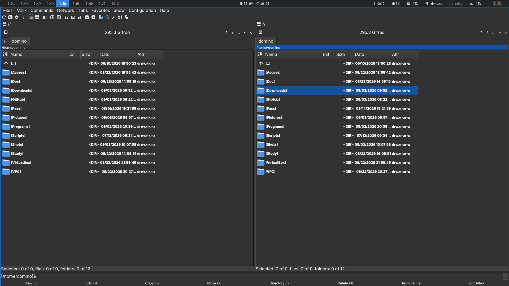

# arch-i3wm-config-adwaita-dark-theme

<div align="center">
  
  
  <br>
  
  
</div>

# Firs step: update & upgrade

```bash
sudo pacman -S update
sudo pacman -S upgrade
reboot
```
```bash
sudo pacman -S update
sudo pacman -S upgrade
reboot
```


